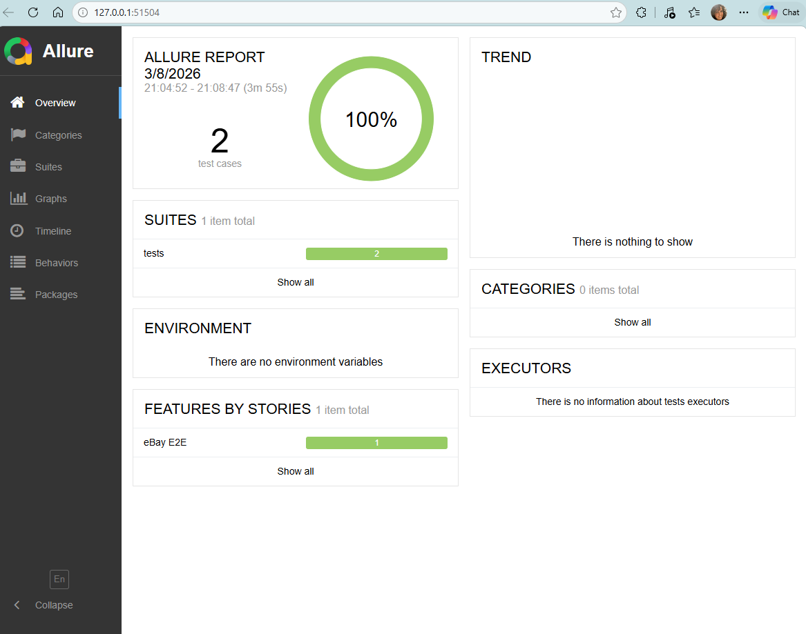

# eBay E2E Automation Framework
**Author:** Lital Entin  
**Stack:** Python · Playwright · pytest · Allure

---

## Overview

End-to-end automation framework for eBay Israel, implementing a full shopping flow:  
**Search → Filter by Price → Add to Cart → Assert Total**

Built with clean architecture: POM, OOP, Data-Driven testing, Smart Locators with fallback, parallel browser execution, and graceful recovery.

---

## Project Structure

```
ebay-automation-repo/
├── pages/
│   ├── base_page.py        # BasePage: navigation, screenshots, SmartLocator factory
│   ├── search_page.py      # Search, price filtering (UI + JS fallback), pagination
│   ├── item_page.py        # Open item, add to cart, popup handling
│   └── cart_page.py        # Navigate to cart, read subtotal, assert budget
├── utils/
│   ├── locator_utils.py    # SmartLocator: multi-locator fallback engine with logging
│   └── retry_utils.py      # @retry_on_failure decorator + RetryContext
├── tests/
│   └── test_ebay_e2e.py    # Data-Driven E2E test (clean, no locator logic)
├── data/
│   └── test_data.json      # Test scenarios: query, max_price, limit, budget_per_item
├── config/
│   └── config.yaml         # Timeouts, browser list, base URL
├── conftest.py             # Fixtures: parallel browsers, scenario parametrize, teardown
├── pytest.ini              # pytest config: log format, parallel workers
├── requirements.txt
└── README.md
```

---

## Prerequisites

- Python 3.10+
- pip
- Java (required for Allure CLI) — see installation steps below

---

## Installation

```bash
# 1. Clone the repo
git clone https://github.com/litalentin-gif/eBay-Automation-Lital-Entin.git
cd eBay-Automation-Lital-Entin

# 2. Install Python dependencies
pip install -r requirements.txt

# 3. Install Playwright browsers
playwright install chromium firefox
```

### Install Allure CLI (Windows)

```powershell
# Install Scoop (if not already installed)
Set-ExecutionPolicy -ExecutionPolicy RemoteSigned -Scope CurrentUser
Invoke-RestMethod -Uri https://get.scoop.sh | Invoke-Expression

# Install Java
scoop bucket add java
scoop install temurin-lts-jdk

# Install Allure
scoop install allure
```

---

## Running the Tests

**Basic run (Chrome + Firefox):**
```bash
pytest tests/test_ebay_e2e.py -v -k "TC_001"
```

**With Allure report:**
```bash
# Step 1 - Run tests and collect results
pytest tests/test_ebay_e2e.py -v -k "TC_001" --alluredir=reports/allure-results

# Step 2 - Refresh PATH (Windows, run once per terminal session)
$env:PATH = [System.Environment]::GetEnvironmentVariable("PATH","User") + ";" + [System.Environment]::GetEnvironmentVariable("PATH","Machine")

# Step 3 - Serve the report (opens browser automatically)
allure serve reports/allure-results
```

---

## Architecture

### POM (Page Object Model)
Each page has a dedicated class. Tests contain zero locator logic — all complexity lives in Page Objects and Utils.

### SmartLocator
Every element defines 2–3 alternative locators (CSS + XPath combinations).  
At runtime, `SmartLocator` tries each in order:
- Logs which locator succeeded / failed
- Takes a failure screenshot on final failure
- Raises a clear error with the full list of attempted locators

### Data-Driven
Test scenarios are loaded from `data/test_data.json`. Adding a new scenario requires zero code changes.

### Parallel Execution
`conftest.py` parametrizes tests by browser (Chrome, Firefox). Each test runs in an isolated browser session with no shared state.

### Retry & Resilience
`@retry_on_failure` decorator with configurable attempts and backoff delay handles flaky network conditions. Price filtering falls back to JavaScript evaluation if the eBay UI filter is unavailable.

---

## Limitations & Assumptions

| Item | Detail |
|------|--------|
| **No login** | eBay Israel requires login for a persistent cart. The framework adds items per-session; cart subtotal verification falls back to summing individual item prices scraped from the page. |
| **Price filter UI** | eBay Israel does not expose a standard price filter input. The framework filters results via JavaScript evaluation of scraped prices. |
| **eBay Israel locators** | Item cards use `s-card__link` (not `s-item__link` used on ebay.com). All locators are tuned for `www.ebay.com` with Israeli locale. |
| **Screenshots** | Saved locally to `reports/screenshots/` — excluded from Git via `.gitignore`. |

---

## Test Data

`data/test_data.json`:
```json
[
  {
    "scenario_id": "TC_001",
    "description": "Search for shoes under $220",
    "query": "shoes",
    "max_price": 800,
    "limit": 5,
    "budget_per_item": 800
  }
]
```
`max_price` and `budget_per_item` are in ILS (Israeli Shekel). 800 ILS ≈ $220.

---

## Reports

- **Allure** — full step-by-step report with screenshots attached to each test
- **Screenshots** — auto-saved on every cart add, assertion, and locator failure
- **Logs** — structured logging per module with SmartLocator attempt tracking

## Allure Report Preview
